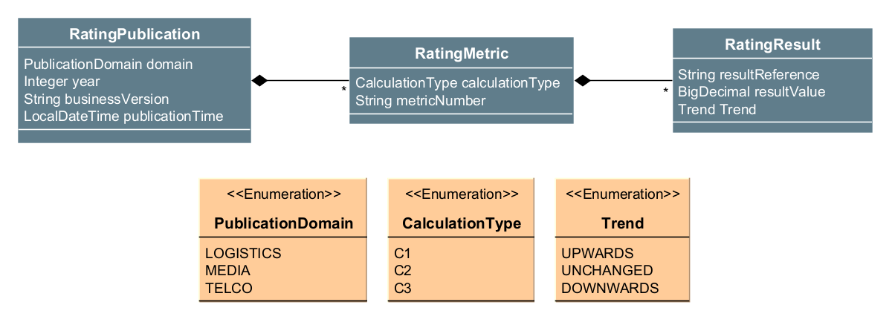
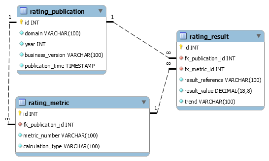

= ckoelle-springboot-r2dbc-ratings
:toc:

== Purpose: It's a showcase

This project is a showcase. 

The showcase is a Spring Boot server software with some exported REST-RPC functionality.

The showcase demonstrates one way of how to process linked entities (e.g. one-2-many relation) transactionally and reactively with the help of:

* Spring Data's reactive repositories,
* Spring Data's r2dbc support (as an reactive driver alternative to JDBC),
* Java _Records_ (instead of _Classes_) as choice to declare Spring Data managed datastructures/entities.

I was motivated to write the showcase as:

* Spring Data's r2dbc support does not offer inter entity relations, as you know it from JPA/Hibernate (@OneToMany).
* The Spring Data examples do not give a hint on how implement entity relations with the reactor reactive syntax.

References:

* https://spring.io/reactive
* https://spring.io/projects/spring-data-r2dbc
* https://github.com/spring-projects/spring-data-examples/tree/main/r2dbc

== Running the showcase

* Prerequisites
** Start a MySQL DBMS (Version 8.0.23 had been used) 
** Add a DB schema. The showcase had be implemented by using
+
[source]
----
CREATE DATABASE ckoelle_r2dbc_demo CHARACTER SET utf8mb4 COLLATE utf8mb4_unicode_ci;
----
** Clone `application.properties.template` to `application.properties` 
** Modify your `application.properties` with your database specific settings.
** Execute the test `de.koelle.christian.spring.r2dbc.ratings.shared.test.ManualDbInitializerTest` to init the schema.
* Start the server by running `de.koelle.christian.spring.r2dbc.ratings.RatingsR2dbcWebfluxApp.java`. 
* Use the example http-requests in `./intellij_http_requests` or take a look at the tests.

== Showcase model

.Business domain model

Notes:

* Consider you have a business _metric_ (e.g. a KPI) and multiple _values_ of it (e.g. KPI values): 
** A _value_ - and to what it refers to - is represented by an instance of `RatingResult`.
** The _metric_ is represented by an instance of `RatingMetric`.
** A bunch of `RatingMetrics` and its `RatingResults` can be published with an instance of `RatingPublication`.

.Technical DB model

Notes:

* The technical DB model provides referential integrity to assure that ... 
** no `RatingResult` can exist without `RatingMetric`.
** no `RatingMetric` can exist without `RatingPublication`.

== Noteworthy aspects and challenges

=== Deletion is done via R2dbcEntityTemplate 
[source,java]
----
@Component
public class BusinessService {
@Transactional
public Mono<Tuple3<Integer, Integer, Integer>> deleteAllRatings(final PublicationDomain domain, final Integer year, final String businessVersion) {
	// Note: Delete returns the amount of deleted rows
	return template.select(RatingPublication.class)
		.matching(
			query(where(RatingPublication.PROPERTYNAME_DOMAIN).is(domain)
				.and(RatingPublication.PROPERTYNAME_YEAR).is(year)
				.and(RatingPublication.PROPERTYNAME_BUSINESS_VERSION).is(businessVersion))
		)
		.one()
		.flatMap(i -> template
			.delete(RatingResult.class)
			.matching(
				query(where(RatingResult.PROPERTYNAME_FK_PUBLICATION_ID).is(i.id()))
			)
			.all()
			.map(j -> Tuples.of(i, j)))
		.flatMap(i -> template
			.delete(RatingMetric.class)
			.matching(
				query(where(RatingMetric.PROPERTYNAME_FK_PUBLICATION_ID).is(i.getT1().id()))
			)
			.all()
			.map(j -> Tuples.of(i.getT1(), j, i.getT2())))
		.flatMap(i -> template
			.delete(RatingPublication.class)
			.matching(
				query(where(RatingPublication.PROPERTYNAME_ID).is(i.getT1().id()))
			)
			.all()
			.map(j -> Tuples.of(i.getT1(), j, i.getT2(), i.getT3())))
		// return the amount of deleted entities/rows.
		.map(i -> Tuples.of(i.getT2(), i.getT3(), i.getT4()));
}
}
----

=== Select and update 

=== 3 versions of full publication retrieval

* There a 3 function signatures to obtain a full rating publication:
+
.BusinessService.java 
[source,java]
----
public Flux<PublicationMetricResultDenormalizedRO> findAllRatingsFlatByTupleQuery(PublicationDomain domain, Integer year, String businessVersion); <1>

public Flux<PublicationMetricResultDenormalizedRO> findAllRatingsFlatByStream(PublicationDomain domain, Integer year, String businessVersion); <2>

public Mono<PublicationWithMetricResultsRO> findAllRatingsHierarchicalByStream(PublicationDomain domain, Integer year, String businessVersion) <3>
----
** The result is either a denormalized flat object structure (`PublicationMetricResultDenormalizedRO` ) , or a hierarchical structure (`PublicationWithMetricResultsRO`).
** (1) executes a plain SQL tuple query. Due to Java 17's new multiline strings, this appears to be manageable, especially, as IntelliJ offers context sensitive SQL expansion help (see link:src/main/java/de/koelle/christian/spring/r2dbc/ratings/dao/RatingResultRepository.java[RatingResultRepository.java].
** The foundation for the stream based retrieval (2) (3) is the following,
+
[source,java]
----
private Flux<Tuple3<RatingPublication, RatingMetric, RatingResult>> findAllRatingsByStream(final PublicationDomain domain, final Integer year, final String businessVersion) {
		return publicationRepo
			.findByMono(domain, year, businessVersion)
			.flatMapMany(i -> metricRepo.findBy(i.id())
				.map(j -> Tuples.of(i, j))
			)
			.flatMap(i -> resultRepo.findBy(i.getT1().id(), i.getT2().id())
				.map(j -> Tuples.of(i.getT1(), i.getT2(), j)));
	}
----
whereas the outcome is either mapped flat (2) or reduced to a singular hierarchical object (3). 

==== Flat structure 
[source,json]
----
[
  {
    "idPublication": 2,
    "idMetric": 3,
    "idResult": 9,
    "publicationDomain": "MEDIA",
    "publicationYear": 2020,
    "publicationBusinessVersion": "0.0.1-SNAPSHOT",
    "publicationTime": "2021-11-22T22:00:37",
    "metricNumber": "sales01",
    "metricCalculationType": "C1",
    "resultReference": "GERMANY",
    "resultValue": 10000.00000000,
    "resultTrend": "UNCHANGED"
  }, ...
----

==== Hierarchical structure
[source,json]
----
{
  "publication": {
    "id": 2,
    "domain": "MEDIA",
    "year": 2020,
    "businessVersion": "0.0.1-SNAPSHOT",
    "publicationTime": "2021-11-22T22:00:37"
  },
  "metricWithResults": [
    {
      "metric": {
        "id": 3,
        "publicationId": 2,
        "metricNumber": "sales01",
        "calculationType": "C1"
      },
      "results": [
        {
          "id": 9,
          "publicationId": 2,
          "metricId": 3,
          "resultReference": "GERMANY",
          "resultValue": 10000.00000000,
          "trend": "UNCHANGED"
        }, ...
----

